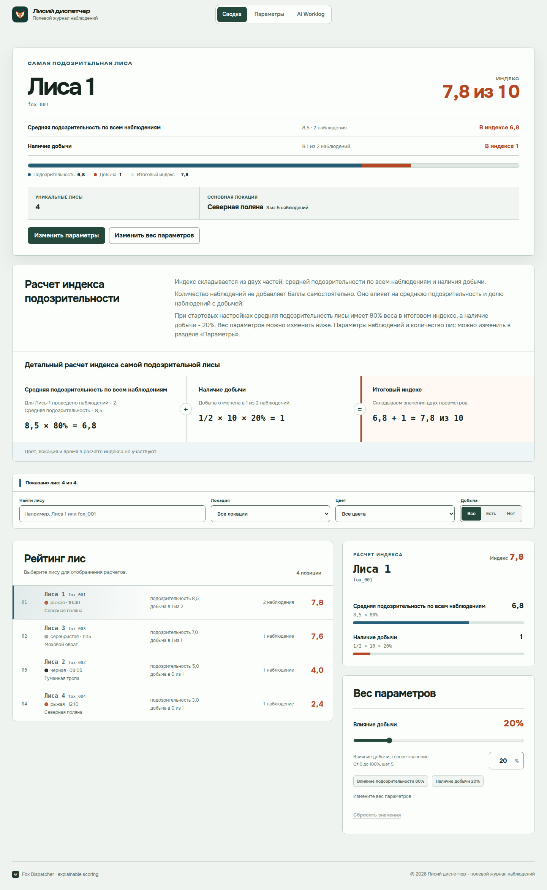

# Лисий диспетчер

Интерактивная панель лесного смотрителя. Приложение превращает наблюдения о лисах в объяснимый рейтинг подозрительности, показывает основную локацию и позволяет сразу увидеть, как изменение данных или веса добычи влияет на итоговый отчёт.



## Ссылки

- Репозиторий: [CaseyRybak/Fox-dispatcher](https://github.com/CaseyRybak/Fox-dispatcher)
- Публичный Vercel-деплой: [fox-dispatcher-brown.vercel.app](https://fox-dispatcher-brown.vercel.app/)
- AI Worklog: вкладка `AI Worklog` внутри приложения, локально — `http://localhost:5173/#worklog`

## Что уже работает

- встроены 5 стартовых наблюдений базового набора;
- показаны 4 уникальные лисы и основная локация — Северная поляна, 3 из 5 наблюдений;
- рейтинг объясняет влияние средней подозрительности и наличия добычи;
- вес добычи можно менять от 0% до 100%, после чего весь отчёт пересчитывается;
- поиск по имени или `fox_id` и фильтры по локации, цвету и добыче существуют только на Сводке; раздел `Параметры` всегда показывает полный журнал и не отображает состояние этих фильтров;
- для каждой лисы доступна прозрачная арифметика результата, а все исходные записи остаются в полном журнале; периодические значения показываются до десятых с явной отметкой округления;
- наблюдения можно добавлять, изменять и удалять; имена лис сохраняются отдельно от автоматически назначаемых `fox_id`, цвет существующей лисы остаётся единым, а удаление имеет одношаговую отмену;
- на узких экранах наблюдения превращаются в читаемые карточки с явной сортировкой, а основная навигация остаётся доступной снизу;
- редактор и опасные подтверждения управляют фокусом как модальные окна и доступны с клавиатуры;
- стартовый набор можно вернуть явно, а принятые записи и вес расчёта сохраняются только в браузере;
- полный набор можно проверить и заменить через paste/file JSON с предпросмотром; экспорт всегда скачивает все наблюдения, независимо от фильтров;
- повреждённое или более новое сохранение не перезаписывается: исходный JSON можно выделить и сохранить до явного восстановления;
- AI Worklog показывает 6 согласованных public-safe чекпоинтов с отдельными текстами решения человека и вклада AI; связанные evidence-данные проверяются в репозитории, но не выводятся в карточках сайта.

## Маршрут проверки за минуту

1. Откройте `Сводку`: стартовый отчёт показывает 5 наблюдений, 4 лисы и лидера Лиса 1 (`fox_001`) с индексом `7,8`.
2. Выберите Лису 1 в рейтинге и проверьте арифметику двух вкладов; полный список исходных записей находится в разделе `Параметры`.
3. Измените влияние добычи с 20% на 30%: лидером должна стать Лиса 3 (`fox_003`) с индексом `7,9`.
4. Откройте `Параметры`, измените подозрительность `obs_005` с 3 на 10 и вернитесь в сводку: лидером станет Лиса 4 (`fox_004`) с индексом `8,0`.
5. Удалите `obs_005`, проверьте уменьшение числа лис до 3, отмените удаление и обновите страницу — восстановленная запись сохранится.
6. Откройте `AI Worklog` и просмотрите 6 согласованных карточек с решением человека и вкладом AI.
7. На вкладке `Параметры` откройте импорт, вставьте JSON, проверьте предпросмотр и только затем подтвердите замену; `Экспортировать все наблюдения` создаёт `fox-dispatcher-observations.json`.

## Как считается подозрительность

По умолчанию итоговый индекс состоит из двух частей:

```text
индекс = средняя suspicion_level × 80% + доля наблюдений с добычей × 10 × 20%
```

Количество наблюдений, цвет, место и время не добавляют скрытые баллы. Они помогают понять объём и контекст доказательств. При стартовых данных лидер — Лиса 1 (`fox_001`) с индексом `7,8`. Если поднять влияние добычи до 30%, лидером становится Лиса 3 (`fox_003`) с индексом `7,9`.

Подробный контракт находится в [продуктовой спецификации](docs/product-specs/fox-dispatcher.md), а причины выбора формулы — в [Decision 0001](docs/decisions/0001-explainable-scoring.md).

## Стек

- React 19 и TypeScript 6;
- Vite 8;
- Zod для входных контрактов;
- Vitest и Testing Library;
- официальный Playwright CLI для production-browser сценариев;
- axe-core для автоматизированной WCAG-проверки реализованных экранов и диалогов;
- Vercel как целевая площадка статического деплоя.

Приложение не использует backend, runtime-вызовы AI, аналитику или внешнюю отправку наблюдений.

## Локальный запуск

Требуются Node.js 24 и npm 11.

```bash
npm ci
npm run dev
```

После запуска откройте адрес, который напечатает Vite. Production-сборка проверяется так:

```bash
npm run build
npm run preview
```

## Проверка

Основной repository gate:

```bash
npm run verify
```

Он проверяет форматирование, lint, архитектурные границы, публичный контент Worklog, закреплённые evidence-ссылки, тесты, типы и production build.

Критические браузерные сценарии:

```bash
npm run test:e2e
npm run test:e2e:worklog
npm run test:e2e:manage-observations
npm run test:a11y
npm run test:e2e:responsive-keyboard
npm run test:e2e:release
npm run test:e2e:import-recovery
```

Первые три сценария проверяют рейтинг, Worklog и управление наблюдениями. `test:a11y` выполняет axe-скан реализованных экранов и диалогов. `test:e2e:responsive-keyboard` проверяет 1440, 768, 390, 320 и landscape, клавиатурный маршрут, отсутствие переполнения, 200% масштаб, текстовые интервалы, reduced motion, forced colors и браузерное accessibility tree. `test:e2e:import-recovery` проверяет атомарный import, реальный download export, перезагрузку, future-version recovery, axe и 320 px.

`test:e2e:release` без переменных проверяет локальный production preview. Для проверки опубликованного артефакта укажите ожидаемую ревизию:

```bash
FOX_SMOKE_BASE_URL=https://fox-dispatcher-brown.vercel.app \
FOX_SMOKE_EXPECTED_REVISION=<40-character-git-sha> \
PLAYWRIGHT_EXECUTABLE_PATH=<chrome> npm run test:e2e:release
```

## Как использовался AI

Codex выступал агентом планирования, реализации, code review и проверки. Репозиторные skills применялись для brainstorming, исполняемых планов, frontend-design, TDD, accessibility, React review и verification-before-completion. Context7 использовался для актуальной справки по библиотекам, а Playwright — для проверки реального production-интерфейса.

Решения человека отделены от вклада AI во встроенном Worklog. Полная переписка не публикуется: каждая из шести карточек показывает этап, дату, цель, принятое человеком решение и вклад AI. Источник дополнительно хранит сведения об изменении, проверке и evidence-ссылках для repository gates, но эти поля не выводятся на сайте.

## Архитектура

Проект использует один bounded context `observation-monitoring` и разделяет domain, application, adapters и UI. Чистые расчёты не зависят от React или браузера, а исполняемая проверка импортов защищает направление зависимостей.

- [Карта репозитория](AGENTS.md)
- [Архитектура](ARCHITECTURE.md)
- [Завершённый план](docs/exec-plans/completed/2026-07-16-fox-dispatcher-implementation.md)
- [Проверка фазы 3](docs/verification/phase-3-evidence-and-activity.md)
- [Проверка фазы 4](docs/verification/phase-4-ai-worklog-and-readme.md)
- [Проверка фазы 5](docs/verification/phase-5-observation-management.md)
- [Проверка фазы 6](docs/verification/accessibility-evidence.md)
- [Проверка релиза](docs/verification/release-evidence.md)
- [Проверка фазы 8](docs/verification/phase-8-import-export-recovery.md)
- [Итоговый аудит фаз и UI/UX](docs/verification/2026-07-17-phase-consistency-ui-audit.md)
- [Сверка документации с текущей реализацией](docs/verification/2026-07-17-current-implementation-documentation-audit.md)
- [Исправления по независимому аудиту](docs/verification/2026-07-18-audit-remediation.md)

## Статус проекта

Фазы 0–8 завершены. Текущая ветка `main` включает последующие улучшения сводки, десятичного объяснения расчёта, управления наблюдениями, устойчивых имён и ID лис, единого цвета лисы и актуальной документации. Vercel подключён к `main`; проверяемая история отдельных релизов и ограничений сохранена в документах раздела `docs/verification/`.
