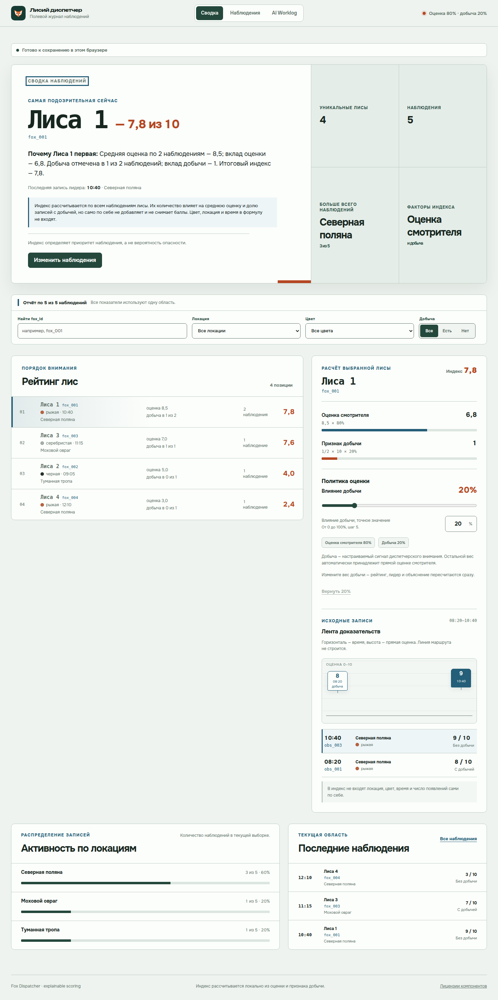

# Лисий диспетчер

Интерактивная панель лесного смотрителя для тестового задания MOX. Приложение превращает стартовые наблюдения о лисах в объяснимый рейтинг подозрительности, показывает активность по локациям и позволяет сразу увидеть, как изменение веса добычи влияет на итоговый отчёт.



## Ссылки

- Репозиторий: [CaseyRybak/Fox-dispatcher](https://github.com/CaseyRybak/Fox-dispatcher)
- Публичный Vercel-деплой: будет добавлен в фазе 7
- AI Worklog: вкладка `AI Worklog` внутри приложения, локально — `http://localhost:5173/#worklog`

## Что уже работает

- встроены все 5 стартовых наблюдений из задания;
- показаны 4 уникальные лисы и основная локация — Северная поляна, 3 из 5 наблюдений;
- рейтинг объясняет вклад исходной оценки и признака добычи;
- вес добычи можно менять от 0% до 100%, после чего весь отчёт пересчитывается;
- поиск и фильтры по лисе, локации, цвету и добыче используют одну область расчёта;
- у каждой лисы доступны исходные записи и точная арифметика результата;
- наблюдения можно добавлять, изменять и удалять; удаление имеет одношаговую отмену;
- на узких экранах наблюдения превращаются в читаемые карточки с явной сортировкой, а основная навигация остаётся доступной снизу;
- редактор и опасные подтверждения управляют фокусом как модальные окна и доступны с клавиатуры;
- стартовый набор можно вернуть явно, а принятые записи и вес расчёта сохраняются только в браузере;
- AI Worklog показывает 6 реальных public-safe чекпоинтов с доказательствами.

JSON import/export и расширенное восстановление повреждённого storage остаются отдельным необязательным расширением.

## Маршрут проверки за минуту

1. Откройте `Сводку`: стартовый отчёт показывает 5 наблюдений, 4 лисы и лидера `fox_001` с индексом `7,8`.
2. Выберите `fox_001` в рейтинге и проверьте исходные записи и арифметику двух вкладов.
3. Измените влияние добычи с 20% на 30%: лидером должен стать `fox_003` с индексом `7,9`.
4. Откройте `Наблюдения`, измените оценку `obs_005` с 3 на 10 и вернитесь в сводку: лидером станет `fox_004` с индексом `8,0`.
5. Удалите `obs_005`, проверьте уменьшение числа лис до 3, отмените удаление и обновите страницу — восстановленная запись сохранится.
6. Откройте `AI Worklog` и просмотрите 6 чекпоинтов с evidence-ссылками.

## Как считается подозрительность

По умолчанию итоговый индекс состоит из двух частей:

```text
индекс = средняя suspicion_level × 80% + доля наблюдений с добычей × 10 × 20%
```

Количество наблюдений, цвет, место и время не добавляют скрытые баллы. Они помогают понять объём и контекст доказательств. При стартовых данных лидер — `fox_001` с индексом `7,8`. Если поднять влияние добычи до 30%, лидером становится `fox_003` с индексом `7,9`.

Подробный контракт находится в [продуктовой спецификации](docs/product-specs/fox-dispatcher.md), а причины выбора формулы — в [Decision 0001](docs/decisions/0001-explainable-scoring.md).

## Стек

- React 19 и TypeScript 6;
- Vite 8;
- Zod для входных контрактов;
- Vitest и Testing Library;
- официальный Playwright CLI для production-browser сценариев;
- axe-core для автоматизированной WCAG-проверки реализованных экранов и диалогов;
- Vercel как целевая площадка статического деплоя.

Приложение не использует backend, runtime-вызовы AI, аналитику или внешнюю отправку наблюдений.

## Локальный запуск

Требуются Node.js 24 и npm 11.

```bash
npm ci
npm run dev
```

После запуска откройте адрес, который напечатает Vite. Production-сборка проверяется так:

```bash
npm run build
npm run preview
```

## Проверка

Основной repository gate:

```bash
npm run verify
```

Он проверяет форматирование, lint, архитектурные границы, публичный контент Worklog, закреплённые evidence-ссылки, тесты, типы и production build.

Критические браузерные сценарии:

```bash
npm run test:e2e
npm run test:e2e:worklog
npm run test:e2e:manage-observations
npm run test:a11y
npm run test:e2e:responsive-keyboard
```

Первые три сценария проверяют рейтинг, Worklog и управление наблюдениями. `test:a11y` выполняет axe-скан реализованных экранов и диалогов. `test:e2e:responsive-keyboard` проверяет 1440, 768, 390, 320 и landscape, клавиатурный маршрут, отсутствие переполнения, 200% масштаб, текстовые интервалы, reduced motion, forced colors и браузерное accessibility tree.

## Как использовался AI

Codex выступал агентом планирования, реализации, code review и проверки. Репозиторные skills применялись для brainstorming, исполняемых планов, frontend-design, TDD, accessibility, React review и verification-before-completion. Context7 использовался для актуальной справки по библиотекам, а Playwright — для проверки реального production-интерфейса.

Решения человека отделены от вклада AI во встроенном Worklog. Полная переписка не публикуется: каждый чекпоинт кратко описывает цель, вклад AI, принятое решение, изменение и проверяемое доказательство.

## Архитектура

Проект использует один bounded context `observation-monitoring` и разделяет domain, application, adapters и UI. Чистые расчёты не зависят от React или браузера, а исполняемая проверка импортов защищает направление зависимостей.

- [Карта репозитория](AGENTS.md)
- [Архитектура](ARCHITECTURE.md)
- [Активный план](docs/exec-plans/active/2026-07-16-fox-dispatcher-implementation.md)
- [Проверка фазы 3](docs/verification/phase-3-evidence-and-activity.md)
- [Проверка фазы 4](docs/verification/phase-4-ai-worklog-and-readme.md)
- [Проверка фазы 5](docs/verification/phase-5-observation-management.md)
- [Проверка фазы 6](docs/verification/accessibility-evidence.md)

## Статус сдачи

Фазы 0–5 и consistency hardening опубликованы на `main`; Phase 6 выполнена и проверена в текущем незакоммиченном рабочем дереве. Публичный Vercel-деплой выполняется отдельно в фазе 7.
